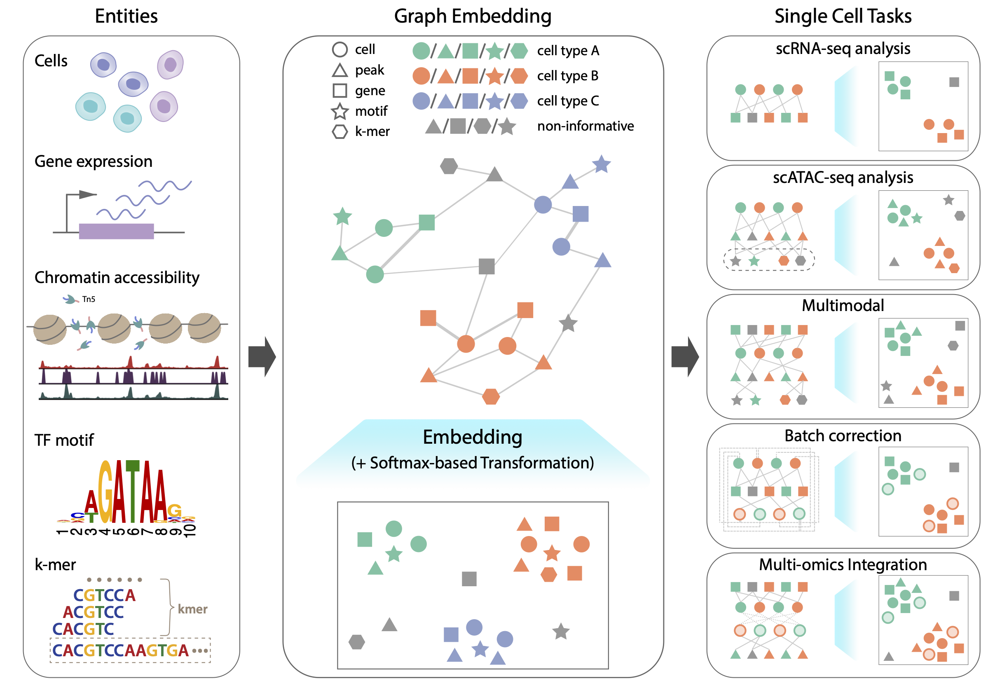

|Docs| |CI| |Install with conda| |Lasst updated| |Downloads| |License|

**SIMBA**: **SI**\ ngle-cell e\ **MB**\ edding **A**\ long with features
========================================================================

SIMBA is a method to embed cells along with their defining features such as gene expression, transcription factor binding sequences and chromatin accessibility peaks into the same latent space. The joint embedding of cells and features allows SIMBA to perform various types of single cell tasks, including but not limited to single-modal analysis (e.g. scRNA-seq and scATAC-seq analysis), multimodal analysis, batch correction, and multi-omic integration.

.. toctree::
   :maxdepth: 2
   :caption: Overview
   :hidden:

   About SIMBA
   Installation
   API
   Release notes
   Citation

.. toctree::
   :maxdepth: 1
   :caption: SIMBA primer

   Basic concepts
   Output

.. toctree::
   :maxdepth: 1
   :caption: Tutorials

   rna_10xpmbc_all_genes
   atac_buenrostro2018_peaks_and_sequences
   multiome_shareseq
   multiome_shareseq_GRN
   rna_mouse_atlas
   rna_human_pancreas
   multiome_10xpmbc10k_integration

.. |Docs| image:: https://readthedocs.org/projects/simba-bio/badge/?version=latest
   :target: https://simba-bio.readthedocs.io

.. |CI| image:: https://github.com/pinellolab/simba/actions/workflows/CI.yml/badge.svg
   :target: https://github.com/pinellolab/simba/actions/workflows/CI.yml

.. |Install with conda| image:: https://anaconda.org/bioconda/simba/badges/installer/conda.svg
   :target: https://anaconda.org/bioconda/simba

.. |Lasst updated| image:: https://anaconda.org/bioconda/simba/badges/latest_release_date.svg
   :target: https://anaconda.org/bioconda/simba

.. |License| image:: https://anaconda.org/bioconda/simba/badges/license.svg
   :target: https://github.com/pinellolab/simba/blob/master/LICENSE

.. |Downloads| image:: https://anaconda.org/bioconda/simba/badges/downloads.svg
   :target: https://anaconda.org/bioconda/simba

